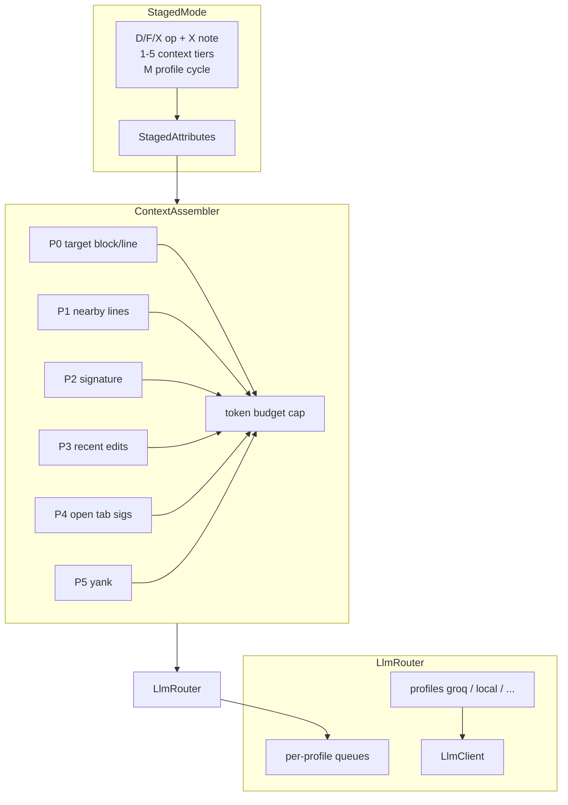

# Context tiers, multi-profile LLM, and changelog

## Preface: local inference timeout

**Yes — local hosts should use a higher default timeout.** Cloud APIs (Groq ~5s) and local `llama-server` (often 30–120s) are different beasts.

**Implementation:** In [`src/config.ts`](src/config.ts) / [`src/llm.ts`](src/llm.ts), resolve effective timeout as:

```typescript
effectiveTimeout = profile.timeoutMs ?? cfg().timeoutMs
  ?? (isLocalBaseUrl(baseUrl) ? 60_000 : 5_000)
```

- `isLocalBaseUrl`: `localhost`, `127.0.0.1`, `::1`, or `*.local`
- Keep global `autocorrect.timeoutMs` as override for all profiles
- Document in README + CHANGELOG: *"openai-compatible + localhost defaults to 60s unless you set timeoutMs"*

---

## Phase 0 — Changelog + immediate fixes (ship first)

### 0a. User-facing CHANGELOG

Create [`CHANGELOG.md`](CHANGELOG.md) (Keep a Changelog format). Summarize everything since `0.1.0` / branch work:

| Area | User-visible changes |
|------|---------------------|
| **Modal menu** | `Ctrl+Shift+;` / double-Ctrl; A/C instant, Shift+A/C stage, S capture, Q review |
| **Staged workflow** | Post-capture `E` → D/F/X flags → `E` send / `Shift+E` enqueue; removed capture `Q` toggle |
| **Queue** | Stores `op` + context note; review picker shows them; unchecked items discarded on apply |
| **Diagnostics** | `line.requireDiagnostic` (Enter) vs `fix.requireDiagnostic` (manual/staged) |
| **Prompt** | `prompt.prefix` global context + staged X note |
| **Response ingress** | Multi-line LLM output kept for line fixes; block replace handles line-count changes |
| **Providers** | `openai-compatible` for Ollama / llama-server at `baseUrl` |

Bump version in [`package.json`](package.json) to `0.2.0` when publishing this batch.

### 0b. Queue block decoration bug

**Symptom:** Multi-line enqueued blocks only show amber on line 1.

**Root cause (likely):** [`fixQueue.ts`](src/fixQueue.ts) `redecorateAll()` passes one multi-line `Range` to a single `isWholeLine` decoration; VS Code border/background can render inconsistently across lines.

**Fix:**
- For block items (`endLine` set), emit **one decoration range per line** (`line,0` → `line,0`) instead of one spanning range
- Optionally add a second decoration type: left **gutter bar** spanning the block for clearer multi-line cue
- Unit test: given `QueuedFix` with `line=2, endLine=5`, assert 4 decoration ranges

### 0c. Stale command menu

[`commandMenu.ts`](src/commandMenu.ts) still references removed `autocorrect.captureSetContext` — update `/context` to enter staged mode or `stagedSetContext`.

---

## Architecture overview



---

## Phase 1 — Provider-aware context policy

### Design principle: prepend is always sent on API

| Provider type | Prefix caching | Context strategy |
|---------------|----------------|------------------|
| **Groq / cloud API** | No KV reuse; every request pays full tokens | **Minimal** default: target + small nearby window only |
| **Local openai-compatible** | Stable `prompt.prefix` + system prompt may help server `--cache-reuse` | **Extended** allowed when flags enabled |

Global [`prompt.prefix`](src/config.ts) and per-op system prompts are **always included** in the user/system messages — there is no client-side cache on Groq. Local benefit is server-side only.

### New settings ([`package.json`](package.json) + [`config.ts`](src/config.ts))

| Setting | Default | Purpose |
|---------|---------|---------|
| `autocorrect.line.contextLines` | `10` | Lines above target (replaces hardcoded `CONTEXT_LINES`) |
| `autocorrect.line.contextLinesBelow` | `0` | Lines below target |
| `autocorrect.line.maxLineChars` | `200` | Per-line trim in context |
| `autocorrect.context.tokenBudget` | `0` | `0` = use profile default; else hard cap |
| `autocorrect.context.ringEnabled` | `false` | Master opt-in for P3–P5 |
| `autocorrect.context.defaultTiers` | `{ nearby: true, signature: false, ... }` | Settings defaults for tiers |

Profile-level override (Phase 2): `contextPolicy: "minimal" | "standard" | "extended"` with preset budgets (e.g. minimal ≈ 512 tok, extended ≈ 2048 tok).

### New module: [`src/contextAssembler.ts`](src/contextAssembler.ts)

Pure + testable (like [`promptMerge.ts`](src/promptMerge.ts)):

1. **Inputs:** `target` text/range, `tierFlags`, `tokenBudget`, `LanguageProfile`, editor snapshot
2. **Priority fill** until budget exhausted:
   - P0: target (never drop)
   - P1: nearby lines (configurable above/below)
   - P2: enclosing symbol signature via `vscode.executeDocumentSymbolProvider` (fallback: regex function/class header)
   - P3: recent edit hunks (new [`src/editRing.ts`](src/editRing.ts) — ring buffer of last N change regions in current file)
   - P4: other visible editors — imports + top-level signatures only
   - P5: last yank/selection snippet (hook `onDidChangeTextDocument` for large pastes + optional copy command)
3. **Compression** (context chunks only): strip blanks/comments, truncate with `…`, dedupe, collapse import blocks
4. **Output:** `{ body: string, estimatedTokens: number, includedTiers: string[] }` for UI + logging

Wire into [`lineCorrector.ts`](src/lineCorrector.ts) and [`stagedExecutor.ts`](src/stagedExecutor.ts) via [`promptContext.ts`](src/promptContext.ts).

### Staged number keys (your choice: `1`–`5`)

Extend [`StagedSession`](src/stagedSession.ts):

```typescript
interface ContextTiers {
  nearby: boolean;      // 1
  signature: boolean;   // 2
  recentEdits: boolean; // 3
  openTabs: boolean;    // 4
  yank: boolean;        // 5
}
```

| Key | Toggle |
|-----|--------|
| `1` | Nearby lines (P1) |
| `2` | Enclosing signature (P2) |
| `3` | Recent edits in file (P3) |
| `4` | Open-tab signatures (P4) |
| `5` | Yank / last copy (P5) |

- [`modeController.ts`](src/modeController.ts): `stagedToggleTier(1..5)`, update `flagsLabel()` → `fix · ctx · 1,2 · ~840tok`
- [`package.json`](package.json) keybindings: `when: autocorrect.stagedMode == true`
- Settings `context.defaultTiers` seed flags on `enterStagedMode(true)`; toggles are per-session overrides

**Token display:** Show estimated tokens in status bar hint when any tier > minimal (no separate panel needed for v1). Log full breakdown to output channel when `debug: true`.

---

## Phase 2 — Multi-profile LLM + per-profile queues

### Profile config

Replace single `provider`/`model`/`baseUrl` with named profiles (backward compat: migrate existing settings into implicit `"default"` profile):

```json
"autocorrect.profiles": [
  {
    "id": "groq",
    "label": "Groq free",
    "provider": "groq",
    "model": "",
    "contextPolicy": "minimal",
    "timeoutMs": 5000
  },
  {
    "id": "local",
    "label": "llama-server",
    "provider": "openai-compatible",
    "baseUrl": "http://127.0.0.1:8080/v1",
    "model": "local",
    "contextPolicy": "extended",
    "timeoutMs": 60000
  }
],
"autocorrect.activeProfile": "groq"
```

### New modules

- [`src/llmRouter.ts`](src/llmRouter.ts) — resolve profile → `LlmClient.complete()` with profile-specific timeout + budget
- [`src/fixQueue.ts`](src/fixQueue.ts) — add `profileId` to `QueuedFix`; internal `Map<profileId, QueuedFix[]>`
- API keys: `autocorrect.apiKey.{profileId}` in secret storage (migrate existing keys)

### Staged profile selection

| Key | Action |
|-----|--------|
| `M` | Cycle active profile (wrap) |
| `Shift+M` | QuickPick profile list |

On submit (`E` / `Shift+E`), use `staged.attributes.profileId` (defaults to `activeProfile`).

### Queue review (your choice: both)

| Key | Action |
|-----|--------|
| `Q` | Review **active profile** queue only |
| `Shift+Q` | Review **all profiles** (grouped sections in QuickPick) |

Status bar: `Autocorrect (3 queued · groq:2 local:1)`.

---

## Phase 3 — In-editor visual indicators

New [`src/stageDecorations.ts`](src/stageDecorations.ts) — layered decorations on staged/queued ranges (not just status bar):

| Visual | Meaning |
|--------|---------|
| Green dashed whole-line | Staged block (existing [`blockCapture.ts`](src/blockCapture.ts)) |
| Amber per-line | Queued fix (Phase 0 fix) |
| **Left border color** | Active profile (`groq`=blue, `local`=teal, custom per profile) |
| **Gutter tick colors** | Op: fix/docs/caveman; small colored marks for tiers 1–5 enabled |
| **Overview ruler** | Block span + profile color |

Refresh on: tier toggle, profile cycle, stage, enqueue, dequeue.

`flagsLabel()` remains in status bar; editor gutters are the primary at-a-glance view while coding.

---

## Phase 4 — Smart prefix stability (document, light code)

No FIM/native llama.cpp protocol — document only:

- Run `llama-server --cache-reuse 256`
- Keep `prompt.prefix` stable across requests
- Optional future: skip re-sending unchanged P1–P4 chunks if hash matches previous request (marginal; defer unless profiling shows need)

---

## Files touched (summary)

| File | Changes |
|------|---------|
| `CHANGELOG.md` | New user changelog |
| `fixQueue.ts` | Per-line deco; `profileId`; per-profile queues |
| `config.ts` / `package.json` | New settings, profiles array, local timeout |
| `contextAssembler.ts` | New — tier assembly + budget |
| `editRing.ts` | New — recent edit hunks |
| `stagedSession.ts` | `ContextTiers`, `profileId` |
| `modeController.ts` | Keys 1–5, M, Shift+M, Shift+Q |
| `stageDecorations.ts` | New — gutter/line colors |
| `llmRouter.ts` | New — multi-profile routing |
| `lineCorrector.ts` / `stagedExecutor.ts` | Use assembler + router |
| `commandMenu.ts` | Fix stale commands |
| `README.md` | Local setup, profiles, context tiers, key map |

---

## Testing

- Unit: `contextAssembler` priority/budget/dedupe; `editRing` shift logic; per-line queue ranges
- Manual F5 checklist: multi-line enqueue shows full amber span; `M` cycles profile; `1`–`5` change token estimate in status bar; `Q` vs `Shift+Q`; local profile uses 60s timeout

---

## Explicit non-goals

- No inline auto-suggest / Tab ghost text (llama.vscode-style prediction)
- No HuggingFace model downloader / env switching UI
- No native FIM/completions endpoint in this pass
